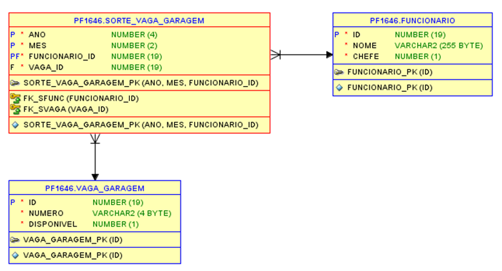
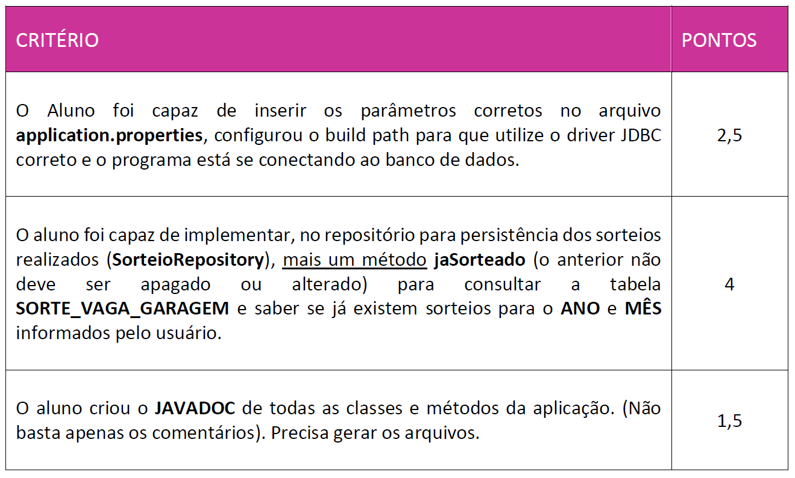

# Checkpoint-prefeitura-vaga-garagem-antes
Este é o CheckPoint aplicado para a Turma de DDD -  JAVA do Curso de Tecnologia em Analise e Desenvolvimento de Distemas da FIAP.

# Estudo de caso

O prefeito e toda a administração da fictícia cidade de Fiaplandia, ficaram muito felizes com o programa que você, em conjunto com toda equipe de TI da prefeitura, desenvolveu para sorteio de vagas de garagem (nosso simulado). Após pesquisa interna, o índice de satisfação entre os empregados da prefeitura aumentou muito.

Entretanto, um fato veio à tona. O setor de qualidade, após auditoria interna, verificou uma fragilidade ao analisar os relatórios desse sistema. Ficou identificado que o funcionário responsável pelo sorteio fraudava o programa. Ele realizava diversas vezes o sorteio para uma determinado mês e ano até que determinadas pessoas fossem sorteadas. Após a simulação do sorteio, este empregado entregava o relatório para publicação no mural da prefeitura. Mal sabia ele, o histórico ficava registrado na tabela SORTE_VAGA_GARAGEM...

Para a solução desta vulnerabilidade, outros controles foram criados, entretanto, para a equipe de desenvolvimento de software, os analistas definiram que: após o usuário informar os dados de ANO e MÊS, o sistema deverá verificar na tabela SORTE_VAGA_GARAGEM se já existe sorteio para o ano e mês informado. Havendo; o programa deverá avisar o usuário que já existe sorteio realizado para o mês e ano informados.

Caberá ao usuário dizer se deseja ([ S ] sim ou [ N ] não) realizar um novo sorteio. Desejando novo sorteio; os dados do sorteio anterior deverão ser apagados da tabela. SORTE_VAGA_GARAGEM. Feito isso, todo fluxo de sorteio seguirá normalmente depois.
Os trabalhos de desenvolvimento foram divididos entre a equipe e você ficou responsável em implementar o método de verificação se já existe sorteio para o MÊS e ANO imputados pelo usuário no programa.

# O que deverá ser feito

O programa que você recebeu já é capaz de se conectar ao banco de dados desde que você preencha corretamente os parâmetros disponíveis no arquivo application.properties. Basta, portanto, preencher os parâmetros nesse arquivo e escolher o driver JDBC correto na pasta lib do projeto para se conectar ao SGBD de sua escolha ou o que esteja disponível.
Lembre-se de:

1º) Baixar o projeto no link que forneceremos abaixo;

2º) O banco de dados não sofreu alteração, mas se você não tiver ou deseje restaurá-lo, basta rodar o script para criação das tabelas no banco de dados (o link será fornecido abaixo);

2º) Adicionar ao build path do projeto o driver JDBC correspondente ao SGBD.

Você deverá criar, no repositório para persistência dos sorteios realizados (SorteioRepository), mais um método jaSorteado (o anterior não deve ser apagado ou alterado) para consultar a tabela SORTE_VAGA_GARAGEM e saber se já existem sorteios para o ANO e Mês informados pelo usuário.

Não se esqueça de criar comentários capazes de gerar o JavaDoc da aplicação e efetivamente criar os arquivos JavaDoc.

# Modelo de dados (Diagrama de entidade e Relacionamento):

# Script para criação do Banco de dados

Caso não tenha as tabelas no seu schema ORACLE, você deverá rodar o script para criação do banco de dados. Segue o link, basta rodar o script contido na pasta do banco de dados que você está utilizando. O professor poderá ajudá-lo nesta etapa:

[https://github.com/Benefrancis/fiap/tree/main/ADS/DDD/Check%20Point/B](https://github.com/Benefrancis/fiap/tree/main/ADS/DDD/Check%20Point/B)  

# Projeto Java

Você deverá baixar o projeto Java para realização do check point. Atenção: você será o último a fazer atualizações nele. Isto quer dizer que todas as outras funcionalidades já estão implementadas e funcionando.

[https://github.com/Benefrancis/fiap/tree/main/ADS/DDD/Check%20Point/B/projeto](https://github.com/Benefrancis/fiap/tree/main/ADS/DDD/Check%20Point/B/projeto)  

# Critério para correção e pontuação:

